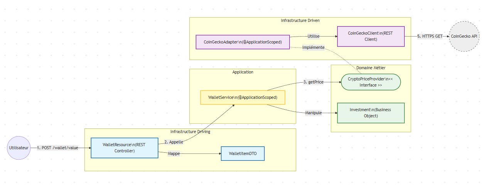

# 🪙 MyCryptoWallet

MyCryptoWallet est une API REST de gestion de portefeuille de crypto-monnaies simplifiée, conçue pour calculer la valorisation d'actifs en temps réel.

Ce projet a été réalisé pour tester l'implémentation rigoureuse de l'Architecture Hexagonale (Ports & Adapters) avec le framework Quarkus.

## 🏗️ Architecture

Le projet respecte strictement la séparation des responsabilités selon le pattern Hexagonal. Le code est organisé pour isoler la logique métier des détails techniques.



Structure du projet (src/main/java/fr/mycryptowallet)
- 🟢 Domain : Le cœur du réacteur. Contient les règles métier (Investment), les exceptions et les interfaces (Ports) comme CryptoPriceProvider. Aucune dépendance framework ici.
- 🟡 Application : Orchestration. Contient WalletService qui lie le domaine et les ports.
- 🔵 Infrastructure :
  - Driving (Entrée) : Ce qui pilote l'application. Contient le contrôleur REST (WalletResource), les DTOs et les Mappers.
  - Driven (Sortie) : Ce qui est piloté par l'application. Contient l'adaptateur vers l'API externe (CoinGeckoAdapter).

## 🛠️ Stack Technique

- Langage : Java 17
- Framework : Quarkus (Supersonic Subatomic Java)
- Build Tool : Maven
- Architecture : Hexagonale (Clean Architecture)
- API Externe : CoinGecko API (via MicroProfile REST Client)
- Tests : JUnit 5, Mockito, AssertJ

## 🚀 Démarrage Rapide

**Prérequis :**

- JDK 17+ installé
- Maven 3.8+

### Lancement en mode développement

Le mode dev de Quarkus permet le rechargement à chaud (Live Reload).

```shell
mvn quarkus:dev
```

L'application sera accessible sur : http://localhost:8080

## 📡 Utilisation de l'API

L'endpoint principal permet de calculer la valeur totale d'un portefeuille.

Endpoint : POST /wallet/value

Exemple de Corps (JSON) :

```json
[
  {
    "crypto": "Bitcoin",
    "quantity": 0.5
  },
  {
    "crypto": "Ethereum",
    "quantity": 10
  }
]
```

Tester avec cURL (Linux / Mac / WSL) :

```shell
curl -X POST "http://localhost:8080/wallet/value" \
     -H "Content-Type: application/json" \
     -d '[{"crypto":"Bitcoin", "quantity":0.5}, {"crypto":"Ethereum", "quantity":2}]'
```

Tester avec PowerShell (Windows) :

```shell
Invoke-RestMethod -Method Post -Uri "http://localhost:8080/wallet/value" `
  -ContentType "application/json" `
  -Body '[{"crypto":"Bitcoin", "quantity":0.5}, {"crypto":"Ethereum", "quantity":2}]'
```

## ✅ Tests Unitaires

Le projet suit une approche AAA (Arrange, Act, Assert) pour structurer chaque test de manière claire et lisible, garantissant que chaque unité de code fonctionne isolément.

Pour lancer tous les tests :

```shell
mvn test
```

## 🚧 TODO
Voici les prochaines étapes et améliorations qui pourraient être apportées au projet :

- [ ] Rendre le choix de la devise dynamique, par défaut c'est en euro dans le code.

- [ ] Implémenter un système de gestion des exceptions.